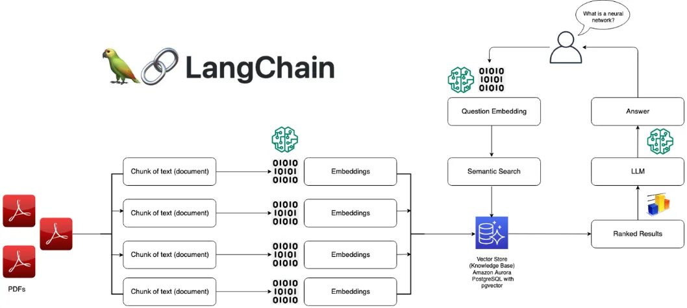

# n8n & Langflow

## AI Agent Nedir?

Kendi başına görevleri gerçekleştirebilen, karar alabilen ve belirli hedeflere ulaşmak için otonom olarak hareket edebilen yazılım sistemleridir. Örneğin raporlar yazmak, e-postalar göndermek, yazılım uygulamalarını yönetmek gibi çeşitli eylemleri gerçekleştirebilir. 

AI agentları, büyük dil modelleri (LLM) olarak bilinen teknolojileri kullanırlar. Bu modeller, agentlara bilgiyi işleme ve karar verme yetenekleri kazandırır. 

LLM’ler statik eğitim verilerine dayanarak metin üretebilseler de, dünya ile etkileşime girme veya bilgilerini dinamik olarak güncelleme yetenekleri yoktur.

Rasyonel bir ajan utility’i maximize eden aksiyonu seçer.

### **Context Window**

Agentın aynı anda işleyebileceği ve hatırlayabileceği maksimum bilgi miktarını ifade eder.

Modern AI agentlarının bağlam penceresi, GPT-4 gibi modellerde 8K, 16K veya 32K token (yaklaşık 6.000–24.000 kelime) gibi değerlere ulaşabilir. Daha büyük bağlam pencereleri, agentların daha fazla bilgiyi aynı anda işlemesine olanak tanır.

**Orchestrator →** Agentın beynini oluşturan bu bileşen, görev akışını yönetir ve sistemin farklı parçaları arasındaki koordinasyonu sağlar.

**AI Modeli →** Agent sisteminin düşünme merkezi olarak görev yapar.

## RAG (Retrieval‑Augmented Generation)

LLM’lerin yalnızca eğitim verilerine değil, dış veri kaynaklarına da dayanarak daha doğru ve güncel metin üretmesini sağlar. Temel modelin kendisini değiştirmeden bir LLM çıktısını hedeflenmiş bilgilerle optimize etmenin yolunu sağlar. Hedeflenmiş bilgiler LLM'den daha güncel, belirli bir kuruluş ve sektöre özgü olabilir. Bu sayede üretken yapay zeka sistemi komutlara daha bağlama uygun yanıtlar sunabilir ve bu yanıtları son derece güncel verilere dayandırabilir.
Örneğin langflowda eğer sadece belgelerle konuşan bir asistan yapmak isteniyorsa kullanılabilir.

**RAG’sız PDF Okuyucu Akışı**

- PDF dosyasındaki tüm içerik çıkarılır. → Büyük dokümanlarda token limiti aşılır.
- Hiç filtreleme yapmadan bütün metin, prompt ile birlikte modele gönderilir. → Her seferinde tüm metin gönderildiği için maliyet yüksek olur.
- Model tek seferde tüm metin üzerinden yanıt üretir. → Gereksiz bilgiler modele yüklenir, cevabın doğruluğu düşebilir.
    
**RAG’lı PDF Okuyucu Akışı**
    
- PDF metni küçük parçalara (chunk) bölünür. → Sadece gerekli parçalar modele gönderildiği için düşük maliyet.
- Her chunk embedding (vektör) haline getirilir ve vektör veritabanına kaydedilir.
- Kullanıcı soru sorduğunda, soru embedding’e dönüştürülür.
- Vektör arama ile soruya en uygun chunk’lar bulunur. → Daha doğru ve bağlama uygun cevap.
- Sadece bu ilgili parçalar modele gönderilir.
- Model bu bilgiyi kullanarak yanıt üretir.
- Modelin güncel bilgiye erişmesi sağlanır.

## n8n

Kod yazmadan iş akışları oluşturmayı sağlayan açık kaynaklı bir otomasyon platformudur. Kullanıcıların farklı uygulamalar, hizmetler ve sistemler arasında entegrasyonlar oluşturmasına izin veren bir “workflow automation tool” olarak tanımlanabilir.

## LangFlow

LangChain tabanlı görsel bir IDE’dir, LLM tabanlı uygulamaları sürükle bırak ile oluşturmayı sağlar. Langflow AI akışını tasarlar, n8n onu tetikler ve yönetir.

### LangChain

LLM'lere tarafından yönlendirilen uygulamalar oluşturmaya yarayan açık kaynaklı bir frameworktür.  Temel olarak diğer LLM’ler, veri kaynakları ve API erişimli işlevler arasında bir aracı görevi görür. Yani kullanıcıların farklı kaynakları birbirine bağlayarak daha özel çözümler oluşturmasına olanak tanıyan kapsamlı bir açık kaynak bileşen kitaplığıdır.

## Multi-Chain Prompting (MCP)

Birden fazla prompt zincirinin (chain) sırayla veya paralel çalışmasıyla karmaşık görevleri çözer. 
Örneğin eğer belgeden önce özet çıkar, sonra soru üret, sonra cevapla gibi bir iş akışı kurulması isteniyorsa kullanılır.

### **Sequential Chain Yaklaşımı**

Birden fazla LLM'i sırayla kullanılabilir:

PDF → Retriever → Prompt 1 (Analiz) → LLM 1 → Prompt 2 (Özet) → LLM 2 → Final Output

- **Chain 1**: Dokümanı analiz et ve ana konuları çıkar
- **Chain 2**: Ana konuları kullanarak detaylı cevap ver
- **Chain 3**: Cevabı Türkçeye optimize et

### **Parallel Chain Yaklaşımı**

Aynı anda farklı görevler yapılabilir. Her chain birbirinden veri beklemeden çalışır. Süreç asenkron ilerleyip en sonunda merge (birleştirme) adımı olur ve bütün chain'lerin çıktıları toplanır.

                     → Prompt A (Özet) → LLM A
    Retrieval Output → Prompt B (Detay) → LLM B  → Combiner → Final
                     → Prompt C (FAQ) → LLM C

## Model Context Protocol

LLM’lerin harici kaynaklara güvenli ve standart şekilde erişmesini sağlayan bir protokol. Yapay zekanın gerçek dünyayla bağlantı kurma şeklini dönüştürüyor. Geleneksel yöntemlerde, bir yapay zeka modelinin her yeni veri kaynağı veya araçla entegre olabilmesi için özel bir API ve özelleştirilmiş kod yazılması gerekiyordu. Bu süreç, hem zaman alıcı hem de karmaşıktı. MCP ise bu sorunu çözerek dış dünya ile bağlantı kurmasını mümkün kılıyor.

İstemci-sunucu mimarisine dayanıyor ve üç temel bileşenden oluşuyor:

***MCP Ana Bilgisayarı (Host): Y***apay zekanın çalıştığı ana uygulama veya arayüzdür. Örneğin, Anthropic’in Claude Desktop uygulaması.

***MCP İstemcisi (Client):*** Ana bilgisayar ile sunucular arasında bir köprü görevi görür. Her istemci, belirli bir MCP sunucusuyla birebir bağlantı kurar ve veri alışverişini yönetir. Örneğin, Claude’un bir dosyaya erişmesi gerektiğinde, istemci bu talebi ilgili sunucuya iletir.

***MCP Sunucuları (Servers):*** Belirli bir aracı veya veri kaynağını yapay zekaya bağlayan bileşenlerdir. Yerel kaynaklara (database) veya uzak kaynaklara (bulut tabanlı API’ler) erişim sağlayabilir. MCP sunucuları, talepleri alır, gerekli işlemleri gerçekleştirir ve sonuçları istemciye geri gönderir.

 Bu bileşenler, yapay zekanın dış dünya ile iletişimini koordine eder.

## Otomasyon Edilebilir İşlemler

### IT Destek Sistemi

Kullanıcılardan gelen destek taleplerini otomatik olarak analiz etmek, sınıflandırmak, önceliklendirmek ve uygun kişilere yönlendirmek.

1. `n8n` Kullanıcının destek talebini bir form, e‑posta ya da Slack webhook ile alır.
2. `n8n` Talep metnini Langflow’a bir HTTP isteğiyle gönderir.
3. `Langflow` Gelen metni analiz eder, hangi kategoriye ait olduğunu (sunucu mu network mü) belirler ve öncelik puanı atar.
4. `Langflow` Sonucu JSON olarak döner.
5. `n8n` Yanıtı alır, ilgili CRM’e (Jira, ServiceNow) yeni bir bilet oluşturur ve takıma Slack ya da e‑posta ile bildirir.
6. `n8n` Eğer aynı kategori tekrar gelirse takip biletleri oluşturur veya otomatik önceliklendirme yapar. İş akışı koşullu dallanabilir.

### Otomatik Log Analizi ve Anomali Bildirimi

Sistem loglarını düzenli aralıklarla kontrol edip, hataları veya kritik anomalileri otomatik tespit ederek ilgili ekipleri zamanında bilgilendirmek.

1. `n8n`belirli aralıklarla (cron tabanlı) log kaynağından veya bir dosyadan veri çeker.
2. Gelen log metnini `Langflow`**’**a gönderir.
3. `Langflow` LLM gücüyle log satırlarını analiz eder: hata, uyarı, analitik bulgular belirler; özetler veya 'kritik hata' işaretler.
4. `n8n`sonucu delil olarak dashboard başlığına kaydeder, kritik bir uyarı varsa ekibi Slack/e-posta ile bilgilendirir.

### IT bilgi tabanını chatbot ile destekleme

IT teknik dokümanlarını analiz ederek chatbot aracılığıyla çalışanlara hızlı cevap veren bilgi tabanlı bir asistan oluşturmak.

1. `n8n` SharePoint veya Google Drive’daki teknik dokümanları çeker.
2. `Langflow` metin içeriklerinden öğrenir; örneğin sıkça sorulan sorulara cevap verebilecek bir chatbot mantığı oluşturur.
3. `n8n` oluşturulan chatbot’ı webhook ile API olarak açığa çıkarır.
4. Kullanıcı Slack’ten veya intranetten bir soru sorduğunda `n8n` ****chatbotu tetikler.
5. `Langflow` yanıt verir ve cevap kullanıcıya döner.
6. Ayrıca cevap geçmişini bir veritabanına kaydeder, gerektiğinde kalite kontrol yapılabilir.

### Çok Adımlı Onay & Dağıtım Süreci

Yazılım dağıtım isteği geldiğinde, teknik dokümanları AI ile analiz ederek özet oluşturmak, onay süreçlerini yürütmek ve insan onayı alındıktan sonra deploy işlemini otomatik hale getirmektir.

1. `n8n` dağıtım talebi bir form, Slack komutu ya da GitHub olayı gibi bir tetikleyiciyle başlar.
2. `n8n` gelen durumda sürüm notu, commit mesajı, teknik değişiklikler gibi bilgiler toplanır ve formatlar.
3. `Langflow` sürüm notlarını analiz eder, güvenlik ve kritik özellik özetini çıkarır ve ilgili ekiplere gönderilecek e‑posta taslağı üretir.
4. `n8n` e‑posta gönderimini yapar, onaylar gelene kadar bekler.
5. Onay sonrası başka sistemlerde yeni dağıtım tetikler (CI/CD, Slack, webhook).
6. Dağıtım tamamlandığında rapor kaydedilir, ilgili kişiler bilgilendirilir.

---

### **Chatbot + AI Entegrasyonu**

Müşteri destek botu, bilgi tabanlı soru cevap sistemi oluşturulabilir.

`n8n` tarafından tetiklenen chatbot mesajı, `Langflow` akışına gönderilir:

1. Webhook tetikler 
2. mesaj `Langflow`'a HTTP isteği olarak iletilir
3. Langflow AI çıktısını döner 
4. `n8n` sonucu formatlar 
5. kullanıcıya gösterir.

### **Veri İşleme & Otomatik Raporlama**

Dashboard güncellemesi, e‑posta gönderimi ya da CRM sistemine yazılma gibi otomasyon oluşturulabilir.

1. `n8n` Google Sheets, Airtable, Slack, e‑posta gibi sistemlerden veri çekip işler.
2. `Langflow` bu verileri doğal dile çevirme, özet oluşturma veya sınıflandırma görevlerinde kullanılır.

# Langflow ile RAG (Retrieval-Augmented Generation) Sistemi

Sistem PDF belgelerini okuyup içeriği hakkındaki soruları istenilen dilde yanıtlayabilecek.

***1.Load Data Flow***

***2. Retriever Flow***

## Gerekli Hazırlıklar

### **Yazılım Kurulumları**

- **Python 3.10+**
- **Langflow** kurulumu
- **AstraDB** hesabı (ücretsiz)
- **Ollama**

### **Langflow Kurulumu**

- [https://www.langflow.org](https://www.langflow.org/) sitesine gidin
- *“Get Started for Free”* butonuna basın sizin için otomatik olarak indirip kurulacaktır.

### **RAG Sistemi Kurulumu**

1. Langflow ana sayfasında "New Flow" tıklayın
2. "Vector Store RAG" template'ini seçin
3. Projeye bir isim verin (örn: "PDF Soru-Cevap")

### **Component Ayarları**

**AstraDB Ayarları**

1. Sağ panelde components kısmından AstraDB bileşenini bulun
2. [https://astra.datastax.com/org](https://astra.datastax.com/org) adresine gidin ve hesap açın
3. Ardından “Create Database” seçin ve database ismini girin ve Provider olarak “Google Cloud” Region olarak da “us-east1” seçin veritabanınızı oluşturun. Birkaç dakika içinde veritabanı oluşturulacaktır.
4. Oluşturulduktan sonra Generate Token diyerek de token oluşturun ve langflowda Astra DB componentinde bulunan Token kısmına yapıştırın. Eğer her seferinde elle girmemek için de dünyaya benzeyen sembole tıklayıp Add New Variable tıklayıp değerleri girerek de kaydedebilirsiniz.
5.  Sonrasında API Endpointini kopyalayın ve bunu da API Endpoint kısmına yapıştırın.
6. Collection Name yerine de aynı şekilde Create Variable diyerek name kısmına collection value kısmını da pdf olarak girin ve “Save Variable” basın.

**Ollama Ayarları**

- Ollama resmi sitesine giriş yapıldıktan sonra "Download" sekmesine tıklanarak bilgisayarın işletim sistemine göre seçim yapılır. İndirme klasörüne gidildikten sonra “ollama-setup.exe” dosyasına çift tıklanır.Kurulum sihirbazı açılır. Kurulum sihirbazındaki talimatlar takip edilir. “Next” butonuna tıklanılır.Lisans sözleşmesini okuyup "I Agree" seçeneği işaretlenir.Kurulum klasörünü onaylanır veya değiştirilir. "Finish" butonuna basılır. Ollama dokümantasyon linkine gidildikten sonra modeller sayfasına geçilir ve buradan "mistral 7:b modeli" seçilir. Terminalden `ollama run mistral` komutu girilerek çalıştırılır.
- Langflow’a gelerek componentten Ollama seçilir ve Base URL kısmına  [http://localhost:11434](http://localhost:11434/) girilir. Model kısmına da indirdiğiniz modeli seçin
- Ollama Embeddings için embedding model olan `mxbai-embed-large:latest` modelini `ollama pull mxbai-embed-large` komutu ile indirin ve component kısmından Ollama Embeddings’i seçin ve model kısmından indirdiğiniz modeli seçin. Ollama Base URL kısmına da [http://localhost:11434](http://localhost:11434/) linkini ekleyin.

### Türkçe Prompt Ayarları

Prompt componentine aşağıdaki metni yazın:

>Görev: PDF dokümanındaki bilgileri kullanarak soruları Türkçe yanıtla.

>Kurallar:

>1. Cevabını sadece Türkçe ver
>2. Verilen bağlam bilgilerini kullan
>3. Bağlamda cevap yoksa "Bu bilgi dokümanda yer almamaktadır" de
>4. Kısa ve net açıklamalar yap
>5. Kaynak göstermek istersen "Dokümana göre..." ile başla

>Bağlam Bilgileri:
>{context}

>Kullanıcı Sorusu: {question}

>Türkçe Yanıt:

### PDF Belgesini Yükleme

- PDF dosyasını hazırlayıp metin içerdiğinden emin olun (taranmış resim değil).
- Sağ component panelinden File bileşenini bulup “Upload File” butonuna basarak PDF dosyasını yükleyin ve “Build” butonuna tıklayın.

### Sistem Testi

- Sağ üstte playground butonuna basarak sistemi çalıştırın.
- Açılan chatte örnek bir soru sorun. (Bu belgede ne anlatılıyor?)
- Entere basın
- Cevap Türkçe bir özet şeklinde olmalı.
